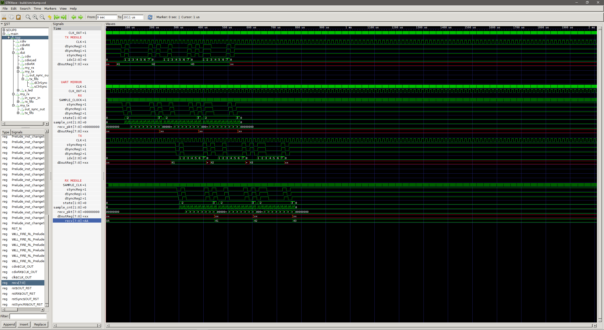
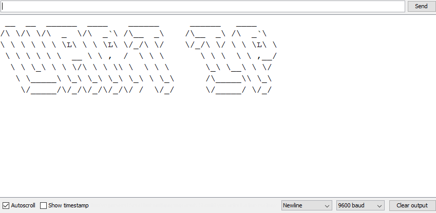

# Basic FPGA stuff on colorlight i5 "dev" board

Playing with bluespec/verilog and the ECP5 on a colorlighti5 board
 - Blinky
 - PWM
 - UART
---

## PWM
Two PWM Generators with 50% and 30% duty cycle

The PWM design as rendered with `netlistsvg` after generating the netlist with `yosys`:

---

## UART
RX and TX modules with customizable Baudrate.  
FIFO input to TX module, FIFO output from RX module, depth is customizable. Simple handshaking interfaces for data input/output via bluespec's Put/Get.  
Splash screen returned by example top module after receiving "spl":
<!--  -->
<!--  -->
<!--  -->

(tested on colorlighti5-v7.0)
