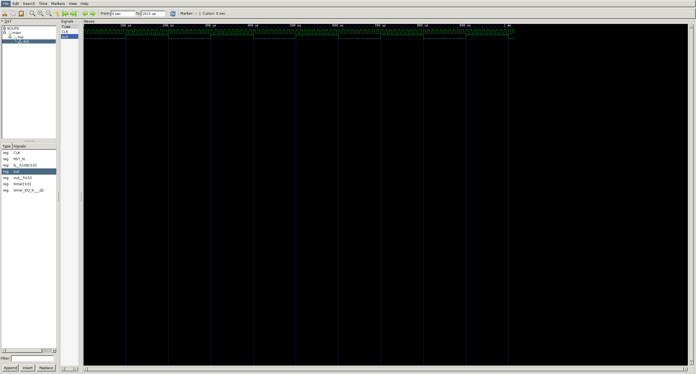
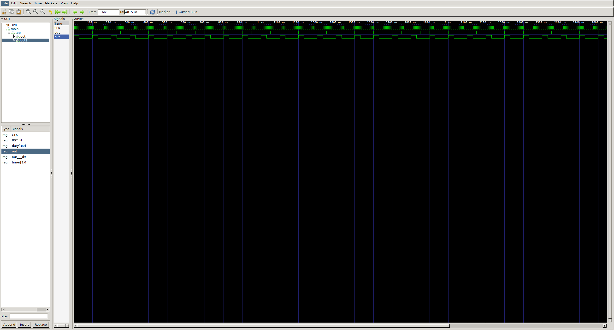
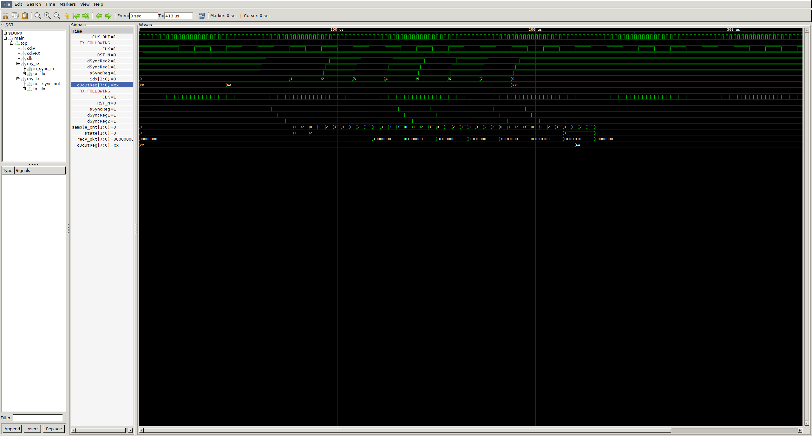
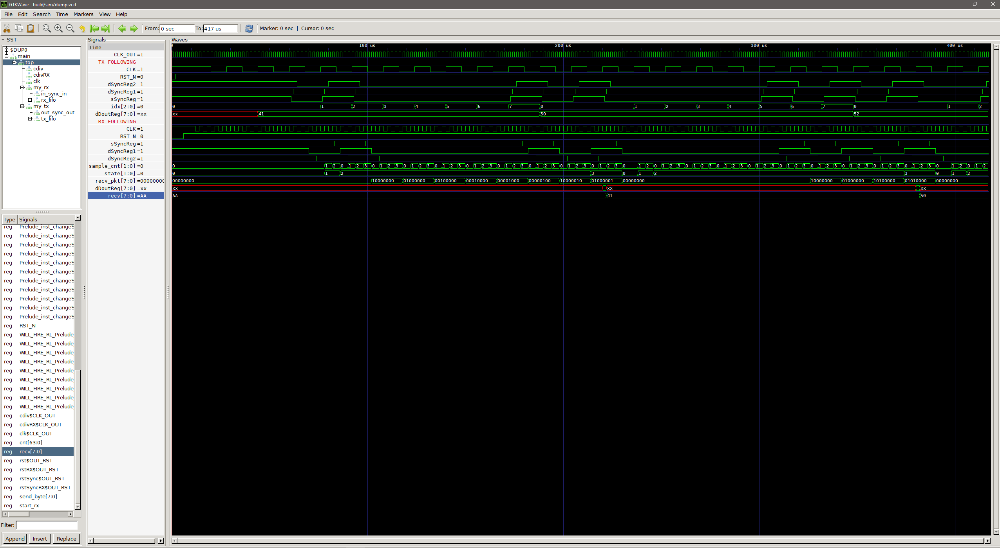

# Basic FPGA stuff on colorlight i5 "dev" board

Playing with bluespec/verilog and the ECP5 on a colorlighti5 board
## Blink
Blinky with 100us between toggles.

---

## PWM
Two PWM Generators with 50% and 30% duty cycle

### TODO:
1. fix compareTop calculation
2. use compile time duty cycle calculations

---

## UART
RX and TX modules with customizable BAUD rate.  
Modules are clocked accordingly.  
Uses Bluespec's built-in clock domain crossing functionalities.  
FIFO input to TX module, FIFO output from RX module.  
RX module has customizable sampling rate.

### Pulling from the RX buffer into a recv register:

### TODO:
1. further simulations
2. HW testing
3. add auto baud in RX module
